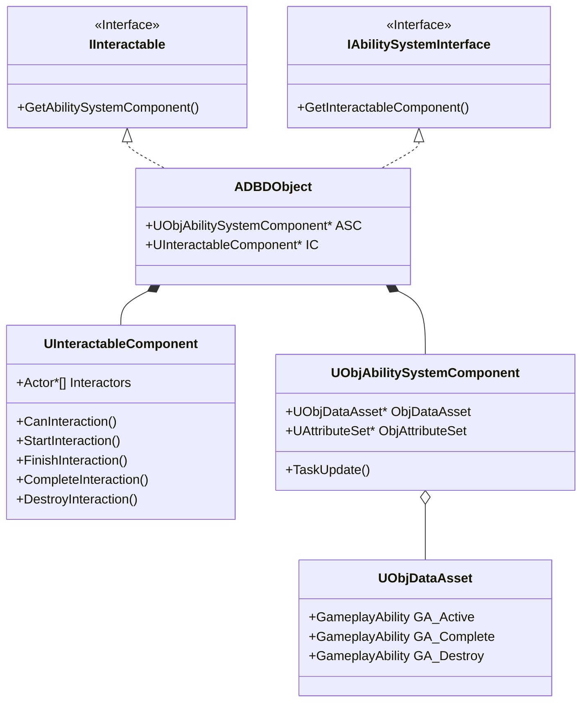

# Dead by Daylight 모작 프로젝트 (포트폴리오)

## 📖 프로젝트 개요
이 프로젝트는 *Dead by Daylight*에서 영감을 받은 비대칭 멀티플레이어 서바이벌 호러 게임으로, **Unreal Engine 5.4**를 사용하여 개발되었습니다.
이 저장소는 팀 프로젝트 진행 중 제가 구현한 기능들의 소스 코드와 블루프린트를 포함하고 있습니다.

## 👨‍💻 담당 업무 및 기여도
저는 **상호작용 시스템**, **오브젝트 로직**, 그리고 핵심 **게임 프레임워크**를 담당했습니다.

### 1. 상호작용 시스템 ([`Source/DBDProject/Private/MMJ`](Source/DBDProject/Private/MMJ))
생존자가 다양한 월드 오브젝트(발전기, 갈고리, 상자 등)와 상호작용할 수 있도록 견고한 상호작용 시스템을 설계하고 구현했습니다.

*   **`ADBDObject` (기반 클래스)**
    *   `IInteractable` 및 `IAbilitySystemInterface` 구현.
    *   스텐실 버퍼(Stencil Buffers)를 사용하여 생존자/살인마에게 오브젝트를 강조 표시하는 **오라(Aura) 시스템** 관리.
    *   오브젝트 가시성 및 상태 복제(Replication) 처리.
*   **상호작용 가능한 오브젝트**
    *   **발전기 (`Obj_Generator`)**: 수리 진행도 및 스킬 체크를 포함한 핵심 목표 메커니즘.
    *   **갈고리, 상자, 탈출구**: 각 상호작용 유형에 대한 고유 로직.
*   **`UInteractableComponent` (상호작용 전용 컴포넌트)**
    *   GAS의 Tag 시스템을 참고한 컴포넌트를 만들어 상호작용의 연결 및 시작 시점과 종료 시점을 제어
    *   StartInteraction(), FinishInteraction() 등의 함수를 override로 다형성 및 확장성에 용이한 구조로 구현
*   **게임플레이 어빌리티 시스템 (GAS)**
    *   **`UObjAbilitySystemComponent`**: "수리 진행도"와 같은 속성을 처리하기 위한 오브젝트 전용 커스텀 ASC.
    *   **`UObjAttributeSet`**: "수리 진행도", "최대 진행도 수치", "손상도 회복 수치" 등의 속성
    *   **`UObjDataAsset`**: 오브젝트의 상호작용 시작 어빌리티, 완료 어빌리티 등과 같은 데이터를 위한 기반 설계.

### 2. 게임 프레임워크 ([`Source/DBDProject/Private/Shared/GameFramework`](Source/DBDProject/Private/Shared/GameFramework))
핵심 게임 루프와 세션 관리 로직을 구현했습니다.

*   **`ADBDGameMode`**
    *   **게임 흐름 관리**: 플레이어 대기, 매치 시작, 오브젝트 개방 조건 판단 처리.
    *   **심리스 트래블(Seamless Travel)**: 로비와 게임 레벨 간의 전환 관리.
    *   **에셋 로딩**: 캐릭터 에셋 및 게임 데이터의 비동기 로딩.
    *   **이벤트 처리**: 발전기 수리 완료, 탈출구 개방, 플레이어 연결 끊김 등의 전역 이벤트 처리.
*   **`ADBDGameStateBase` & `ADBDPlayerState`**
    *   중요한 게임 상태 정보를 모든 클라이언트에 복제.
    *   플레이어 상태(생존, 갈고리 걸림, 탈출) 및 점수 추적.

## 🛠️ 기술 스택
*   **엔진**: Unreal Engine 5.4 (C++ & Blueprints)
*   **핵심 시스템**: Gameplay Ability System (GAS), 리플리케이션 (네트워킹)

## 📂 디렉토리 구조
*   [`Source/DBDProject/Private/MMJ`](Source/DBDProject/Private/MMJ) : 오브젝트 및 상호작용 로직의 핵심 구현부.
*   [`Source/DBDProject/Private/Shared/GameFramework`](Source/DBDProject/Private/Shared/GameFramework) : 게임 모드 및 프레임워크 클래스.

---
*이 프로젝트는 교육 및 포트폴리오 목적으로 제작되었습니다.*
